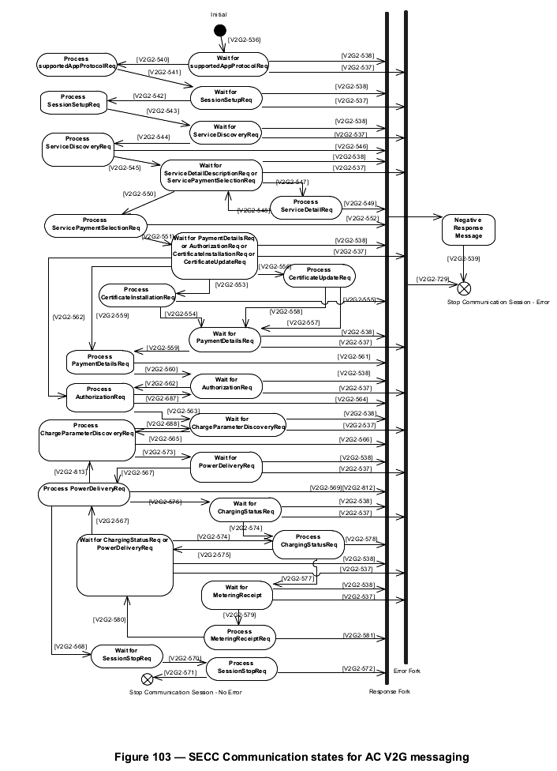

# sistemas_distribuidos_paxos_state_machine

This project intend to implement a State machine replication based on the paxos algorithm in EV charge points perspective

The simulation of the EVs behaviour will occurr in a 10 minutes span of time. With the following steps:

- System BootUp, the CPs talks to each other
- Minute 1: EV1 connects
- Minute 2: EV2 connects
- Minute 4: EV3 connects
- Minute 8: EV1 stops charging
- Minute 9: EV2 e EV3 stops charging

## Software Arquitecture

### EV behaviour emulator

Can be a class called charge point that have some states atributed to them, like:

- ev.not_connected
- ev.connected_not_charging
- ev.sendNeeds
- ev.receiveScheduling
- ev.charging_with_profile
- ev.charging_without_profile

### EVSE behaviour emulator

The behaviour of the EVSE in High level communication is defined by the image bellow, an fsm based on ISO 15118-2 messages

Can be a class called charge point that have some states atributed to them, like:

- ChargingPoint.waitingEV
- ChargingPoint.beginSession
- ChargingPoint.authentication
- CharginPoint.energyNegotiation
- ChargingPoint.charging
- ChargingPoint.endSession
- ChargingPoint.restartingsession
- ChargingPoint.failure

### Paxos algorithm

OCPP (Open Charge Point Protocol) is a communication protocol that is used to manage electric vehicle charging stations. It is based on a client-server architecture, where the charging stations are the clients and the central system is the server.

Here is an example of how Paxos might be used to implement a distributed system using OCPP, with a central system acting as the proposer and the charging stations acting as the acceptors:

A client sends a request to the central system, asking it to reserve a charging station for a specific time period.

The central system sends a "prepare" message to the charging stations, proposing a reservation for a specific charging station at a specific time.

The charging stations respond with a "promise" message, indicating that they will not accept any more reservation proposals until they receive a message from the central system.

The central system sends an "accept" message to the charging stations, proposing a reservation for a specific charging station at a specific time.

The charging stations respond with an "acknowledge" message, indicating that they have accepted the proposed reservation.

Once a majority of the charging stations have acknowledged the proposed reservation, the central system has reached consensus and the reservation is accepted.

The client is notified of the agreed-upon reservation, and the system is ready to handle new requests.

This is just a high-level overview of how Paxos might be used with OCPP. There are many details and variations that are beyond the scope of this answer. If you would like more information about OCPP, I recommend visiting the OCPP website:

# State Machine Replication with paxos in OCPP and ISO 15118-2 context 

One example of a use case where a cluster of EVSEs work together using state machine replication with Paxos and communicate through OCPP, but in a distributed manner instead of a centralized CSMS, could be a network of EV charging stations in a city.

In this scenario, the EVSEs would be organized into a Paxos cluster, with each EVSE serving as a replica in the cluster. The cluster would use Paxos to ensure that updates to the shared state (such as charging status and availability) are made in a consistent and fault-tolerant manner.

The EVSEs would communicate with each other using the OCPP protocol, allowing them to share information and coordinate their actions. For example, an EVSE that is running low on power might communicate with other EVSEs in the cluster to find one that has spare capacity, and then redirect an incoming EV to that EVSE.

Instead of having a central CSMS, the EVSEs would be able to communicate with each other in a distributed manner and make decisions based on their available resources and charging status. The EVSEs would also be able to handle the charging process with the EV using ISO 15118-2 standard, such as the negotiation of the charging parameters, the start and stop of the charging session and the transfer of the payment and the consumption details.

This approach would allow for a more resilient and efficient EV charging network, as the EVSEs would be able to adapt to changing conditions and make decisions based on the real-time state of the network.

A real-use case scenario involving the negotiation and charging parameters between at least 3 EVSEs in a distributed EV charging network could be as follows:

Imagine a city with a network of EV charging stations, organized into a Paxos cluster. An EV driver pulls into the city and starts searching for available charging stations using a mobile app. The app communicates with the nearest EVSE, which in turn queries the Paxos cluster to determine the status of all the EVSEs in the network.

The nearest EVSE finds that it is at capacity and redirects the EV to another EVSE that has spare capacity. The EV then pulls into the parking lot of this EVSE and initiates a charging session. The EVSE uses the ISO 15118-2 standard to negotiate the charging parameters with the EV, such as the maximum current and voltage that the EV can handle, and the desired charging time.

As the charging progresses, the EVSE continuously communicates the charging status with the cluster using the OCPP protocol, updating the shared state of the network. Meanwhile, another EV pulls into the city and starts searching for a charging station. The nearest EVSE finds that it has spare capacity, but it's being used by another EV and it redirects the second EV to another EVSE that has spare capacity.

This EVSE also uses the ISO 15118-2 standard to negotiate the charging parameters with the second EV, and the charging session starts. In this scenario, the cluster of EVSEs work together in a distributed manner, coordinating their actions and sharing resources to ensure that all EVs are able to charge efficiently and effectively.

In this scenario, the Paxos algorithm ensures that the shared state of the network is consistent, while the OCPP protocol allows the EVSEs to communicate with each other and coordinate their actions. And the ISO 15118-2 standard ensures the secure and standardized negotiation and charging process between the EVSE and the EV.

In a distributed EV charging network where EVSEs are organized into a Paxos cluster, the EVSEs use the OCPP protocol to communicate with each other and share information.

The OCPP protocol defines a set of messages that the EVSEs can use to perform various functions, such as:

Sending status updates: EVSEs can send messages to the cluster to update their status, such as their current availability, charging status, and power level.

Requesting information: EVSEs can send messages to the cluster to request information from other EVSEs, such as their availability and charging status.

Redirecting EVs: EVSEs can send messages to the cluster to redirect an EV to another EVSE that has spare capacity.

Managing reservations: EVSEs can send messages to the cluster to make, update or cancel a reservation for an EV, this can be done by the EV or the EVSE itself.

Handling payments: EVSEs can send messages to the cluster to handle payments for charging sessions, this can include the negotiation of the payment method, the transfer of funds, and the confirmation of payment.

When an EVSE receives a message from another EVSE, it updates its local state accordingly. For example, if an EVSE receives a message from another EVSE indicating that it is now available, the EVSE updates its local state to reflect this.

The Paxos algorithm ensures that the shared state of the network is consistent, it does this by allowing the EVSEs to propose updates to the shared state and agree on the order of these updates. This ensures that all EVSEs have the same view of the network state, even in the presence of failures or network partitions.

This allows the EVSEs to make decisions based on the real-time state of the network, such as redirecting an EV to an EVSE that has spare capacity, and making or canceling reservations. Additionally, using ISO 15118-2 standard, the EVSEs can securely negotiate and handle the charging parameters, payments and other details between the EVSE and the EV.

The EVSEs also need to handle the secure communication with the EV, to ensure that only authorized EVs are able to charge, and that the charging session is secure and tamper-proof.